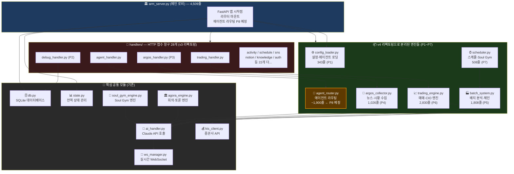

# CORTHEX HQ — 코드 구조 다이어그램

> 마지막 업데이트: 2026-02-28 (P7 완료 기준)



## 비유로 보는 구조

```
corthex-hq.com
      ↓
arm_server.py (로비 — 안내·연결만)
      ↓
┌─────────────────────────────────────────┐
│ handlers/ (접수 창구 28개)              │
│  요청 받아서 → 엔진으로 전달            │
└─────────────────────────────────────────┘
      ↓
┌─────────────────────────────────────────┐
│ 엔진들 (실제 일하는 곳)                │
│  trading_engine.py  — 매매 결정         │
│  batch_system.py    — 분석 공장         │
│  scheduler.py       — 시간 관리         │
│  argos_collector.py — 정보 수집         │
│  agent_router.py    — 에이전트 지휘 (P8)│
└─────────────────────────────────────────┘
      ↓
┌─────────────────────────────────────────┐
│ 공통 도구들                             │
│  ai_handler.py  — Claude API            │
│  kis_client.py  — 증권사 연결           │
│  db.py          — 데이터 저장           │
│  ws_manager.py  — 실시간 화면 업데이트 │
└─────────────────────────────────────────┘
```

## 줄수 변화 (v4 기준)

| 시점 | arm_server.py | 비고 |
|------|--------------|------|
| v4 시작 | 11,637줄 | 모든 것이 한 파일 |
| P1~P7 완료 | 4,509줄 | 7개 모듈 분리 |
| P8 완료 후 | ~300줄 (예상) | 얇은 로비만 남음 |
