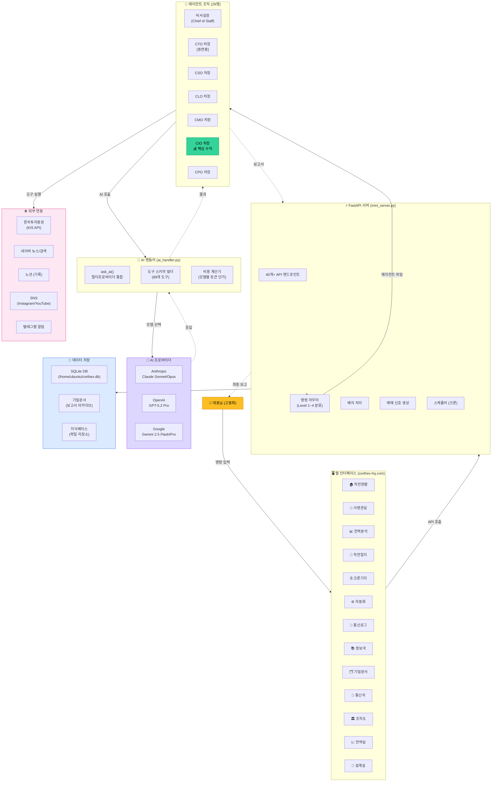

# CORTHEX HQ — 최상위 아키텍처

> VSCode에서 `Ctrl+Shift+V` 누르시면 그림으로 보입니다.

## 전체 시스템 구조

## 핵심 흐름 (3줄 요약)

1. **대표님** → 사령관실에서 명령 입력
2. **서버** → Level 1~4로 분류 → 해당 처장에게 위임 → 처장 + 전문가들 병렬 분석
3. **보고** → 처장이 종합 → 텔레그램/화면으로 대표님께 보고
