# CORTHEX HQ — 에이전트 조직도

> VSCode에서 `Ctrl+Shift+V` 누르시면 그림으로 보입니다.

## 전체 에이전트 조직 (29명)

```mermaid
flowchart TD
    CEO["👤 고동희 대표님 (CEO)"]

    subgraph SEC["🏛️ 비서실"]
        CoS["비서실장\nChief of Staff\nClaude Sonnet 4.6\n추론: medium"]
        RI["정보 보좌관\nreport_specialist\nGemini 3.1 Pro\n추론: high"]
        SS["일정 보좌관\nschedule_specialist\nGemini 2.5 Flash\n추론: low"]
        RS["중계 보좌관\nrelay_specialist\nClaude Sonnet 4.6\n추론: medium"]
    end

    subgraph LEET["🔧 LEET Master 기술사업부"]
        CTO["CTO 기술개발처장\nGemini 2.5 Flash\n⚠️ 현재 동면중"]
        FE["프론트엔드 전문가\nfrontend_specialist\nGemini 2.5 Flash"]
        BE["백엔드 전문가\nbackend_specialist\nGemini 2.5 Flash"]
        INF["인프라 전문가\ninfra_specialist\nGemini 2.5 Flash"]
        AIE["AI모델 전문가\nai_model_specialist\nGemini 2.5 Flash"]

        CSO["CSO 사업기획처장\nClaude Sonnet 4.6\n추론: medium"]
        MRS["시장조사 전문가\nmarket_research_specialist"]
        BPS["사업계획 전문가\nbusiness_plan_specialist"]
        FMS["재무모델 전문가\nfinancial_model_specialist"]

        CLO["CLO 법무·IP처장\nGemini 3.1 Pro Preview\n추론: high"]
        CPS["저작권 전문가\ncopyright_specialist"]
        PTS["특허/약관 전문가\npatent_specialist"]

        CMO["CMO 마케팅처장\nGemini 2.5 Flash\n추론: low"]
        SUS["설문조사 전문가\nsurvey_specialist"]
        CNS["콘텐츠 전문가\ncontent_specialist"]
        CMS["커뮤니티 전문가\ncommunity_specialist"]
    end

    subgraph INV["📈 투자분석 본부"]
        CIO["CIO 투자분석처장\nGPT-5.2 Pro\n추론: high/xhigh\n💰 핵심 수익 엔진"]
        MCS["시황분석 전문가\nmarket_condition_specialist"]
        SAS["펀더멘탈 전문가\nstock_analysis_specialist"]
        TAS["기술적분석 전문가\ntechnical_analysis_specialist"]
        RMS["리스크관리 전문가\nrisk_management_specialist"]
    end

    subgraph PUB["📚 출판·기록 본부"]
        CPO["CPO 출판·기록처장\nClaude Sonnet 4.6\n추론: medium"]
        CHS["연대기 전문가\nchronicle_specialist"]
        EDS["편집 전문가\neditor_specialist"]
        ARS["아카이브 전문가\narchive_specialist"]
    end

    CEO -->|"명령"| CoS
    CoS -->|"처장 위임"| CTO
    CoS -->|"처장 위임"| CSO
    CoS -->|"처장 위임"| CLO
    CoS -->|"처장 위임"| CMO
    CoS -->|"처장 위임"| CIO
    CoS -->|"처장 위임"| CPO
    CoS --- RI
    CoS --- SS
    CoS --- RS

    CTO --- FE
    CTO --- BE
    CTO --- INF
    CTO --- AIE

    CSO --- MRS
    CSO --- BPS
    CSO --- FMS

    CLO --- CPS
    CLO --- PTS

    CMO --- SUS
    CMO --- CNS
    CMO --- CMS

    CIO --- MCS
    CIO --- SAS
    CIO --- TAS
    CIO --- RMS

    CPO --- CHS
    CPO --- EDS
    CPO --- ARS

    style CEO fill:#fbbf24,stroke:#d97706,color:#000
    style CoS fill:#a78bfa,stroke:#7c3aed,color:#000
    style CTO fill:#9ca3af,stroke:#6b7280,color:#000
    style CIO fill:#34d399,stroke:#059669,color:#000
    style CPO fill:#60a5fa,stroke:#2563eb,color:#000
    style CSO fill:#f472b6,stroke:#db2777,color:#000
    style CLO fill:#fb923c,stroke:#ea580c,color:#000
    style CMO fill:#4ade80,stroke:#16a34a,color:#000
```

## 처장별 핵심 역할

| 처장 | 역할 한 줄 요약 | 도구 수 | 모델 |
|------|----------------|---------|------|
| 비서실장 | CEO 명령 분류 + 배분 + 종합 | 12개 | Claude Sonnet |
| CTO | 기술 결정 (동면중) | 8개 | Gemini Flash |
| CSO | 시장 기회 + 사업 전략 | 8개 | Claude Sonnet |
| CLO | 법률·지재권 리스크 관리 | 6개 | Gemini Pro |
| CMO | 고객 획득·유지·수익화 | 7개 | Gemini Flash |
| CIO | 투자 분석 + 매매 신호 💰 | 21개 | GPT-5.2 Pro |
| CPO | 지식 기록·편집·출판 | 11개 | Claude Sonnet |
