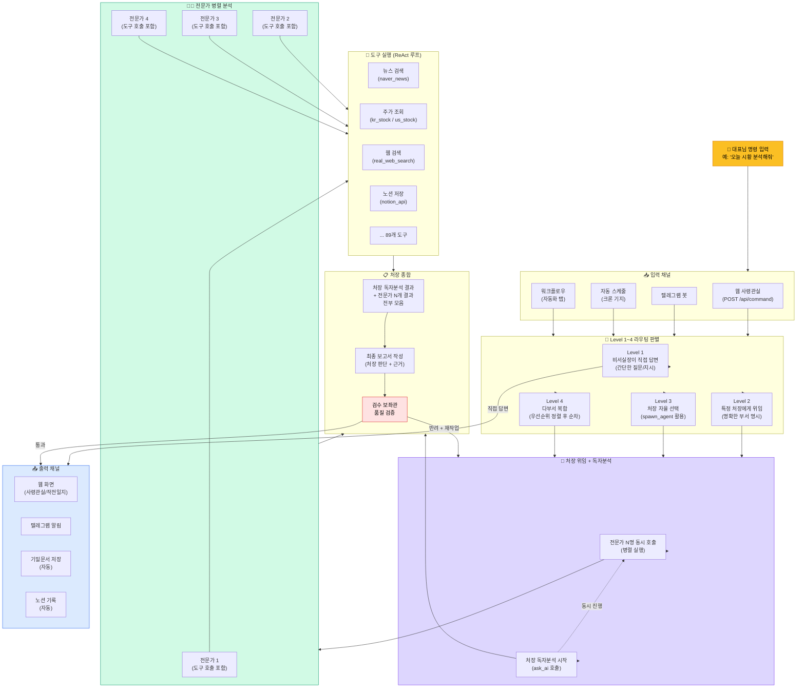

# CORTHEX HQ — 명령 처리 흐름

> VSCode에서 `Ctrl+Shift+V` 누르시면 그림으로 보입니다.
> 비유: 군 지휘 체계. 대통령(대표님) 명령 → 참모총장(비서실장) → 각 사령관(처장) → 부대원(전문가)

## 명령 처리 전체 흐름

## Level 분류 기준

| Level | 조건 | 예시 |
|-------|------|------|
| Level 1 | 간단한 정보 조회, 일정 확인 | "오늘 스케줄 알려줘" |
| Level 2 | 특정 부서 명시 | "@CIO 시황 분석해줘" |
| Level 3 | 부서 미지정, 복잡한 판단 필요 | "NVDA 지금 살까?" |
| Level 4 | 여러 부서 동시 필요 | "사업계획 + 법적검토 + 마케팅 전략 세워줘" |

## 핵심: "처장 = 5번째 분석가" 원칙

> 처장은 전문가 결과를 **취합만** 하지 않고, **본인도 독자 분석**을 병렬로 수행합니다.
> 이렇게 하면 처장이 전문가에게 끌려가지 않고 독립적인 판단을 내릴 수 있습니다.
