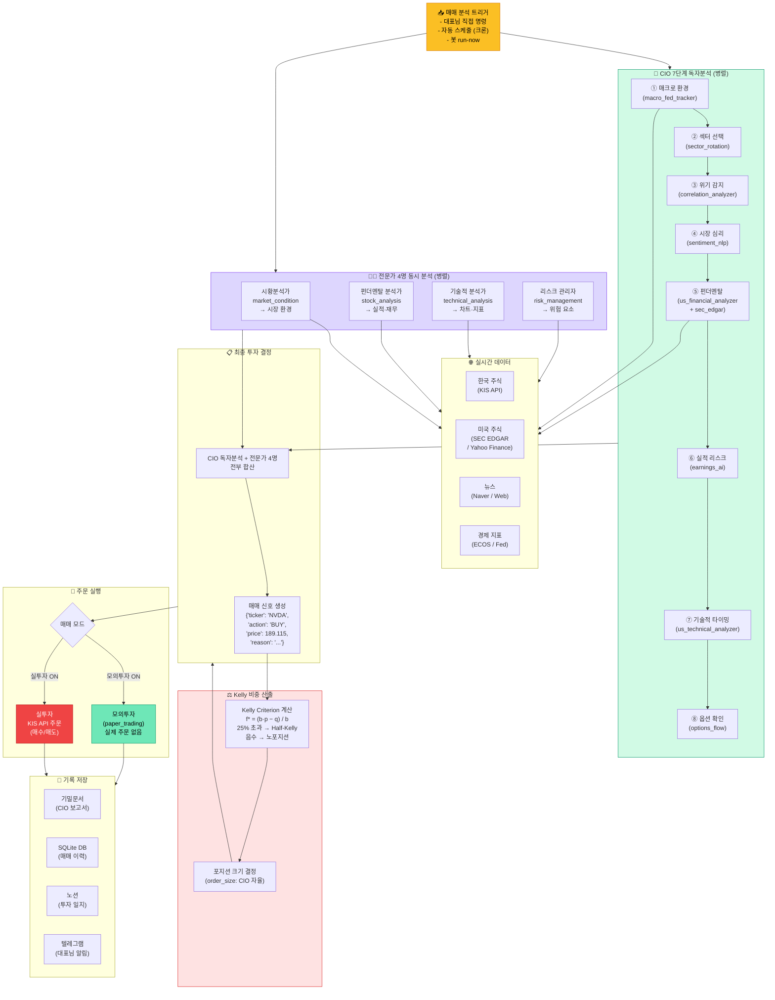

# CORTHEX HQ — CIO 매매 흐름

> VSCode에서 `Ctrl+Shift+V` 누르시면 그림으로 보입니다.
> 비유: 주식 운용팀 회의. CIO(최고투자책임자)가 혼자 분석하면서, 동시에 4명 애널리스트에게도 분석 지시.

## CIO 매매 신호 생성 흐름

## 주요 도구 목록

| 구분 | 도구 | 용도 |
|------|------|------|
| 한국 | kr_stock, dart_monitor, stock_screener | 국내 주가·공시 |
| 미국 | sec_edgar, us_financial_analyzer, earnings_ai | 미국 실적·재무 |
| 기술 | us_technical_analyzer, chart_generator | 차트·지표 |
| 심리 | sentiment_nlp, options_flow | 시장 심리·옵션 |
| 거시 | macro_fed_tracker, global_market_tool | Fed·환율·경제 |
| 포트폴리오 | portfolio_optimizer_v2, financial_calculator | Kelly·비중 최적화 |

## 첫 실매매 기록

> 2026-02-21 04:38 KST — NVDA 1주 매수 @ $189.115 (첫 실거래 성공)
