# CORTHEX HQ — UI 탭 기능 맵

> VSCode에서 `Ctrl+Shift+V` 누르시면 그림으로 보입니다.

## 전체 탭 구조 (13개)

```mermaid
flowchart LR
    APP["🖥️ CORTHEX HQ\ncorthex-hq.com"]

    subgraph PRIMARY["기본 탭 (항상 표시)"]
        direction TB
        HOME["🏠 작전현황\nhome\n─────────────\n대시보드 통계\n퀵 액션 버튼\nAI 사용량\n예산 현황"]
        CMD["💬 사령관실\ncommand\n─────────────\n명령 입력창\n채팅 히스토리\n에이전트 멘션\n세션 관리"]
        PERF["📊 전력분석\nperformance\n─────────────\n에이전트별 성능\n품질 점수 차트\n거절 사유 분석\nSoul 진화 제안"]
        HIST["📜 작전일지\nhistory\n─────────────\n작업 기록 목록\n검색·필터링\n북마크\n작업 재생"]
        SCHED["⏰ 크론기지\nschedule\n─────────────\n예약 작업 목록\nCRON 등록\n활성화 토글\n프리셋 선택"]
    end

    subgraph SECONDARY["더보기 탭"]
        direction TB
        WORK["⚙️ 자동화\nworkflow\n─────────────\n워크플로우 목록\n단계별 편집\n실행·상태 확인"]
        ACT["📡 통신로그\nactivityLog\n─────────────\nSSE 실시간 로그\nActivity/Comms\nQA/Tools 서브탭"]
        KNOW["📚 정보국\nknowledge\n─────────────\n파일 목록\n내용 보기·편집\n새 파일 생성"]
        ARCH["🗂️ 기밀문서\narchive\n─────────────\n보고서 아카이브\n부서별 분류\n교신 ID 검색"]
        SNS["📱 통신국\nsns\n─────────────\nInstagram 게시\nYouTube 업로드\nOAuth 인증"]
        ARCHMAP["🏛️ 조직도\narchmap\n─────────────\nMermaid 조직도\n비용 도넛 차트\n에이전트별 비용"]
        TRADE["📈 전략실\ntrading\n─────────────\n포트폴리오 현황\n매매 신호 목록\n주문 실행\n관심종목 시세"]
        FLOW["📐 설계실\nflowchart\n─────────────\n뼈대 다이어그램\nMermaid 편집기\n저장·불러오기"]
    end

    APP --> PRIMARY
    APP --> SECONDARY

    HOME -->|"GET /api/dashboard\nGET /api/budget\nGET /api/quality"| API1[" "]
    CMD -->|"POST /api/command\nGET /api/presets\nSSE /api/comms/stream"| API2[" "]
    PERF -->|"GET /api/performance\nGET /api/quality/scores\nGET /api/soul-evolution"| API3[" "]
    HIST -->|"GET /api/tasks\nDELETE /api/tasks/{id}\nGET /api/replay/{id}"| API4[" "]
    SCHED -->|"GET /api/schedules\nPOST /api/schedules\nPOST .../toggle"| API5[" "]
    WORK -->|"GET /api/workflows\nPOST .../execute\nGET .../execution/{id}"| API6[" "]
    ACT -->|"GET /api/activity-logs\nGET /api/comms/messages\nSSE /api/comms/stream"| API7[" "]
    KNOW -->|"GET /api/knowledge\nPOST /api/knowledge\nDELETE /api/knowledge/..."| API8[" "]
    ARCH -->|"GET /api/archive\nGET .../by-correlation/{id}"| API9[" "]
    SNS -->|"GET /api/sns/status\nPOST /api/sns/instagram/photo\nPOST /api/sns/youtube/upload"| API10[" "]
    ARCHMAP -->|"GET /api/architecture/hierarchy\nGET .../cost-summary\nGET .../cost-by-agent"| API11[" "]
    TRADE -->|"GET /api/trading/portfolio\nPOST /api/trading/order\nGET /api/trading/signals"| API12[" "]
    FLOW -->|"GET /api/knowledge/flowcharts\nPOST /api/knowledge"| API13[" "]

    style HOME fill:#fef3c7,stroke:#d97706
    style CMD fill:#ede9fe,stroke:#7c3aed
    style TRADE fill:#d1fae5,stroke:#059669
    style FLOW fill:#dbeafe,stroke:#2563eb
```

## 탭별 데이터 로드 방식

| 탭 | 렌더 방식 | 로드 시점 | 실시간 갱신 |
|----|-----------|-----------|------------|
| 작전현황 | x-show | init() | 수동 |
| 사령관실 | x-show | init() | SSE (1개) |
| 전력분석 | x-if | switchTab | 수동 |
| 작전일지 | x-if | switchTab | 수동 |
| 크론기지 | x-show | init() | 수동 |
| 자동화 | x-if | switchTab | 수동 |
| 통신로그 | x-if | switchTab | SSE 공유 |
| 정보국 | x-show | init() | 수동 |
| 기밀문서 | x-if | switchTab | 수동 |
| 통신국 | x-if | switchTab | 수동 |
| 조직도 | x-if | switchTab | 수동 |
| 전략실 | x-if | switchTab | 폴링 30초 |
| **설계실** | **x-if** | **switchTab** | **수동** |
