# CORTHEX HQ — 데이터 저장 흐름

> VSCode에서 `Ctrl+Shift+V` 누르시면 그림으로 보입니다.
> 비유: 회사 문서 관리 시스템. 일반 업무는 파일 캐비닛(DB), 중요 보고서는 금고(기밀문서), 참고 자료는 도서관(지식베이스).

## 전체 데이터 흐름

```mermaid
flowchart TD
    ACTION["⚡ 서버에서 발생하는 모든 이벤트\n(명령 실행 / 분석 완료 / 매매 신호 / 스케줄 등)"]

    subgraph SQLITE["💾 SQLite DB\n/home/ubuntu/corthex.db\n(git 밖 — 배포해도 안 날아감)"]
        direction TB
        T_TASKS["tasks 테이블\n작업 목록 + 상태 + 결과"]
        T_SETTINGS["settings 테이블\n시스템 설정값\n(save_setting / load_setting)"]
        T_AGENTS["agent_stats 테이블\n에이전트별 비용·성능 통계"]
        T_COMMS["comms_log 테이블\n에이전트 교신 로그"]
        T_QUALITY["quality_scores 테이블\n검수 결과 + ELO 점수"]
        T_BATCH["batch_jobs 테이블\n배치 작업 상태"]
        T_TRADE["trade_history 테이블\n매매 이력"]
        T_SCHED["schedules 테이블\n크론 예약 작업"]
    end

    subgraph ARCHIVE["🗂️ 기밀문서\n(보고서 아카이브)"]
        direction TB
        A_CIO["투자분석/\n(CIO 보고서)"]
        A_CSO["사업기획/\n(CSO 보고서)"]
        A_CLO["법무/\n(CLO 보고서)"]
        A_CMO["마케팅/\n(CMO 보고서)"]
        A_CTO["기술개발/\n(CTO 보고서)"]
        A_CPO["출판기록/\n(CPO 보고서)"]
    end

    subgraph KNOWLEDGE["📚 지식베이스\n(/api/knowledge)"]
        direction TB
        K_FLOW["flowcharts/\n시스템 다이어그램\n(설계실에서 관리)"]
        K_ETC["기타 폴더/\n(대표님이 직접 관리)"]
    end

    subgraph NOTION["📋 노션\n(외부 연동)"]
        N_DB["노션 DB\n(CPO가 자동 기록)"]
    end

    subgraph TELEGRAM["📱 텔레그램\n(실시간 알림)"]
        TG["대표님 DM\n(중요 이벤트)"]
    end

    ACTION -->|"작업 시작/완료"| T_TASKS
    ACTION -->|"설정 변경"| T_SETTINGS
    ACTION -->|"AI 호출마다"| T_AGENTS
    ACTION -->|"에이전트 간 통신"| T_COMMS
    ACTION -->|"검수 결과"| T_QUALITY
    ACTION -->|"배치 제출"| T_BATCH
    ACTION -->|"주문 실행"| T_TRADE
    ACTION -->|"스케줄 등록"| T_SCHED

    ACTION -->|"분석 완료\n(처장 보고서)"| ARCHIVE
    ACTION -->|"다이어그램 저장"| K_FLOW
    ACTION -->|"CPO가 기록"| N_DB
    ACTION -->|"중요 이벤트"| TG

    subgraph READ["📖 읽기 경로 (UI → API → DB)"]
        UI_HIST["작전일지 탭\n→ GET /api/tasks"]
        UI_ARCH["기밀문서 탭\n→ GET /api/archive"]
        UI_KNOW["정보국 탭\n→ GET /api/knowledge"]
        UI_FLOW["설계실 탭\n→ GET /api/knowledge/flowcharts"]
        UI_TRADE["전략실 탭\n→ GET /api/trading/history"]
        UI_ACT["통신로그 탭\n→ GET /api/activity-logs"]
    end

    T_TASKS --> UI_HIST
    ARCHIVE --> UI_ARCH
    K_FLOW --> UI_FLOW
    KNOWLEDGE --> UI_KNOW
    T_TRADE --> UI_TRADE
    T_COMMS --> UI_ACT

    style SQLITE fill:#dbeafe,stroke:#2563eb
    style ARCHIVE fill:#fce7f3,stroke:#db2777
    style KNOWLEDGE fill:#d1fae5,stroke:#059669
    style NOTION fill:#fef3c7,stroke:#d97706
    style TELEGRAM fill:#e0e7ff,stroke:#4f46e5
```

## 저장소별 특징

| 저장소 | 위치 | 특징 | 접근 |
|--------|------|------|------|
| SQLite DB | 서버 `/home/ubuntu/corthex.db` | git 밖, 배포해도 안 날아감 | `save_setting()` / `load_setting()` |
| 기밀문서 | 서버 파일시스템 | 부서별 폴더, 마크다운 | `/api/archive` |
| 지식베이스 | 서버 파일시스템 | 대표님이 직접 편집 가능 | `/api/knowledge` |
| 노션 | 외부 (Notion API) | CPO가 자동 기록 | `notion_api` 도구 |
| 텔레그램 | 외부 (Telegram API) | 실시간 알림 | `notification_engine` 도구 |

## 중요 규칙

> ⚠️ JSON 파일 저장 절대 금지 — 배포 시 초기화됨
> ✅ 모든 영구 데이터는 SQLite DB에 저장 (`save_setting()` / `load_setting()` 사용)
