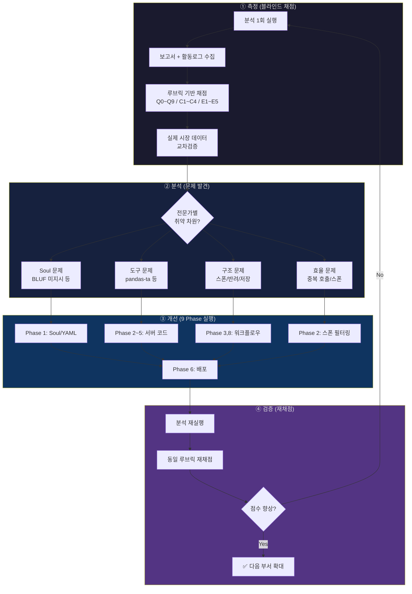

# 01. 전체 품질 개선 사이클

> 비유: **시험 → 빨간펜 → 보충수업 → 재시험**
> 투자분석처에서 시작 → 전 부서 확대 가능한 구조

## 다이어그램

## 향후 전 부서 확대 시

이 사이클을 CSO/CMO/CPO/CLO에도 동일 적용.
각 부서의 `quality_rules.yaml` 섹션이 이미 존재 (법무/마케팅/전략 등).
부서별 루브릭만 추가하면 같은 **측정→분석→개선→검증** 사이클 반복 가능.
