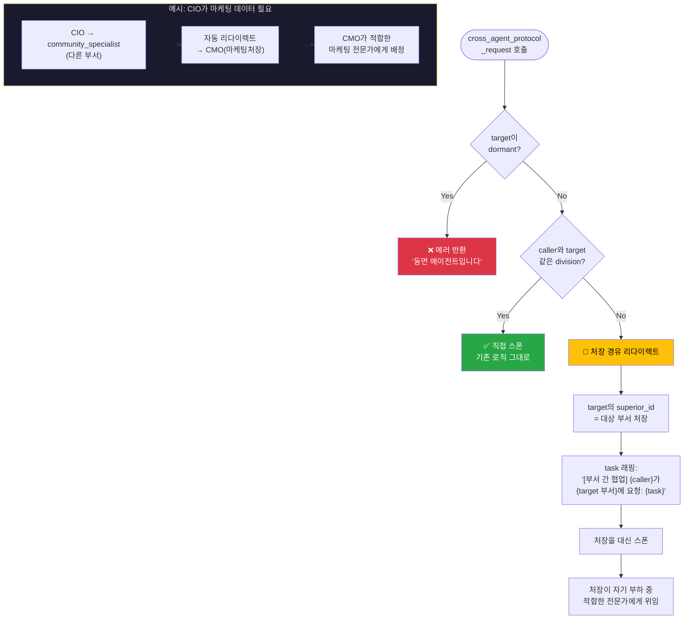

# 02. 스폰 필터링 알고리즘 (C-1안)

> 비유: **회사에서 다른 부서 직원한테 직접 일 시키면 안 됨.**
> 그 부서 팀장한테 요청하면 팀장이 적합한 직원 배정.

## 다이어그램

```mermaid
flowchart TD
    START([cross_agent_protocol<br/>_request 호출]) --> CHK1{target이<br/>dormant?}

    CHK1 -->|Yes| ERR1[❌ 에러 반환<br/>'동면 에이전트입니다']

    CHK1 -->|No| CHK2{caller와 target<br/>같은 division?}

    CHK2 -->|Yes| DIRECT[✅ 직접 스폰<br/>기존 로직 그대로]

    CHK2 -->|No| ROUTE[🔄 처장 경유 리다이렉트]

    ROUTE --> FIND[target의 superior_id<br/>= 대상 부서 처장]
    FIND --> WRAP["task 래핑:<br/>'[부서 간 협업] {caller}가<br/>{target 부서}에 요청: {task}'"]
    WRAP --> SPAWN[처장을 대신 스폰]
    SPAWN --> DELEGATE[처장이 자기 부하 중<br/>적합한 전문가에게 위임]

    subgraph EXAMPLE["예시: CIO가 마케팅 데이터 필요"]
        EX1["CIO → community_specialist<br/>(다른 부서)"] -.-> EX2["자동 리다이렉트<br/>→ CMO(마케팅처장)"]
        EX2 -.-> EX3["CMO가 적합한<br/>마케팅 전문가에게 배정"]
    end

    style ERR1 fill:#dc3545,color:white
    style DIRECT fill:#28a745,color:white
    style ROUTE fill:#ffc107,color:black
    style EXAMPLE fill:#1a1a2e,color:#e0e0e0
```

## 향후 확대

모든 부서 처장이 `subordinate_ids`를 가지고 있으므로,
이 알고리즘은 6개 부서 전체에 자동 적용됨.
