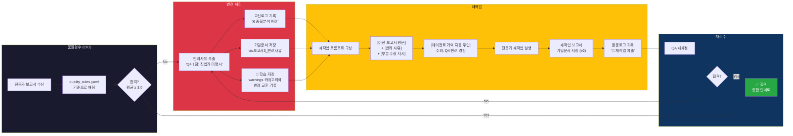

# 03. 반려 → 학습 → 재작업 사이클

> 비유: **시험지에 빨간펜 코멘트 → 학생이 다음 시험 전에 복습.**
> 반려 교훈이 `warnings`에 저장되면, 이 전문가가 **다음 분석에서도** 자동 주입됨.

## 다이어그램

## 학습의 핵심

반려 교훈이 `warnings`에 저장되면, 이 전문가가 **다음 분석에서도** 자동 주입됨.

### 향후 확대
같은 메모리 시스템이 모든 29명 에이전트에 적용 가능.
