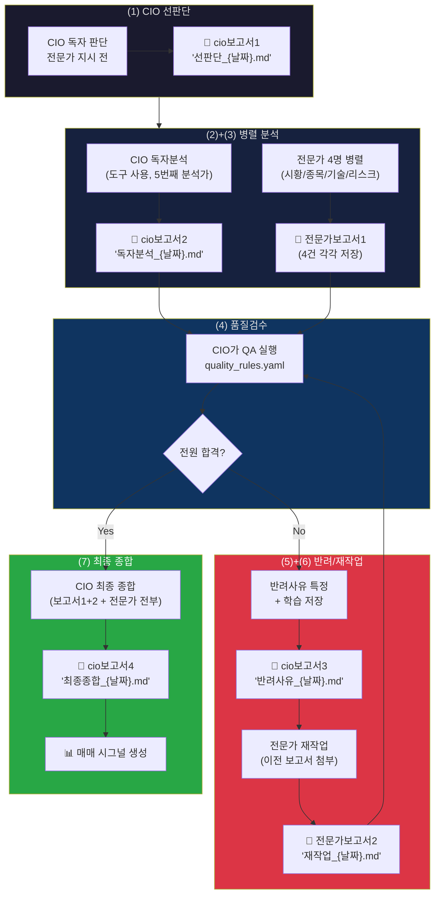

# 04. CIO 7단계 워크플로우 + 산출물

> 비유: **팀장의 하루** — 먼저 혼자 판단하고, 팀원들 보고 받고, 품질 검수하고, 종합.

## 다이어그램

## 현재 vs 목표

- **현재**: (7) 최종 종합만 기밀문서 저장
- **목표**: 7단계 각각의 산출물이 별도 기밀문서로 남아야 함

## 산출물 저장 매핑

| 단계 | 저장할 문서 | 파일명 패턴 | 구현 Phase |
|------|-----------|------------|-----------|
| (1) CIO 선판단 | cio보고서1 | `cio보고서1_선판단_{날짜}.md` | Phase 8 |
| (2) 전문가 보고서 | 전문가보고서1 (각각) | `{전문가}_보고서1_{날짜}.md` | Phase 8 |
| (3) CIO 독자분석 | cio보고서2 | `cio보고서2_독자분석_{날짜}.md` | Phase 8 |
| (5) 반려사유 | cio보고서3 | `cio보고서3_반려사유_{날짜}.md` | Phase 3 |
| (6) 재작업 결과 | 전문가보고서2 | `{전문가}_보고서2_재작업_{날짜}.md` | Phase 3 |
| (7) CIO 최종 | cio보고서4 | 이미 저장됨 ✅ | - |

## 향후 확대

같은 `_manager_with_delegation()` 함수를 CSO/CMO/CPO/CLO도 사용하므로,
여기서 추가한 `save_archive()` 호출은 모든 부서에 자동 적용됨.
