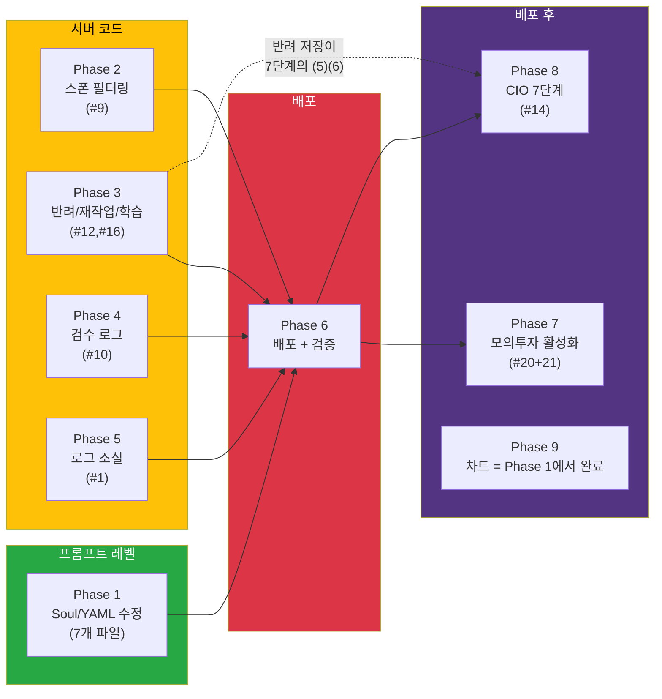
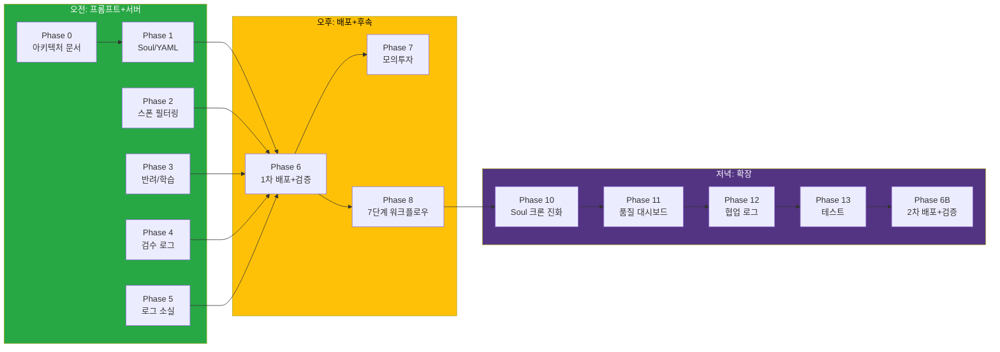

# 05. Phase 실행 순서 + 의존관계

> 비유: **리모델링 공정표** — 배관(서버코드)이 끝나야 타일(배포) 붙일 수 있음.

## Phase 1~8 의존관계

## 전체 실행 순서 (Phase 0~13)

## compact 전략

- Phase 1~5는 **병렬 작업 가능** (서로 독립)
- Phase 6(배포) 후 Phase 7~8 순차
- 대표님이 중간에 compact하셔도 각 Phase가 독립적이라 이어받기 가능

## Phase별 비유 요약

| Phase | 비유 | 한 줄 설명 |
|-------|------|-----------|
| 0 | 설계도 보관 | 아키텍처 문서 폴더 생성 + CEO 아이디어 기록 |
| 1 | 직원 매뉴얼 업데이트 | "결론 먼저, 도구 시점 표기, 차트는 코드로" |
| 2 | 다른 팀 직접 부르기 방지 | 같은 팀=직접, 다른 팀=팀장 경유, 휴직=차단 |
| 3 | 빨간펜 교정 시스템 | 틀린 부분만 고쳐라 + 교훈 저장 + 기밀문서 보관 |
| 4 | 성적표 형식 개선 | 과목마다 10장 → 1장 성적표 + 색깔 구분 |
| 5 | 서랍 크기 키우기 | 100개→5,000개 보관 + 검색 기능 |
| 6 | 건물 입주 | 서버 배포 + 검증 |
| 7 | 스위치 켜기 | 모의투자 활성화 |
| 8 | 보고서 아카이브 확대 | 7단계 각각 기밀문서 저장 |
| 10 | 주간 매뉴얼 리뷰 | 7일마다 반려 패턴 → soul 개선 제안 → 대표님 승인 |
| 11 | 학생 성적 추이 그래프 | 전문가 점수 추이 대시보드 |
| 12 | 부서 간 협조 대장 | 협업 기록 + 향후 조직 최적화 |
| 13 | 구조 검사 | 핵심 함수 자동 테스트 |
