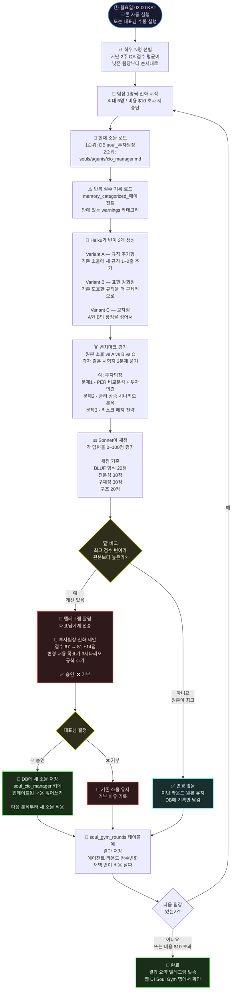
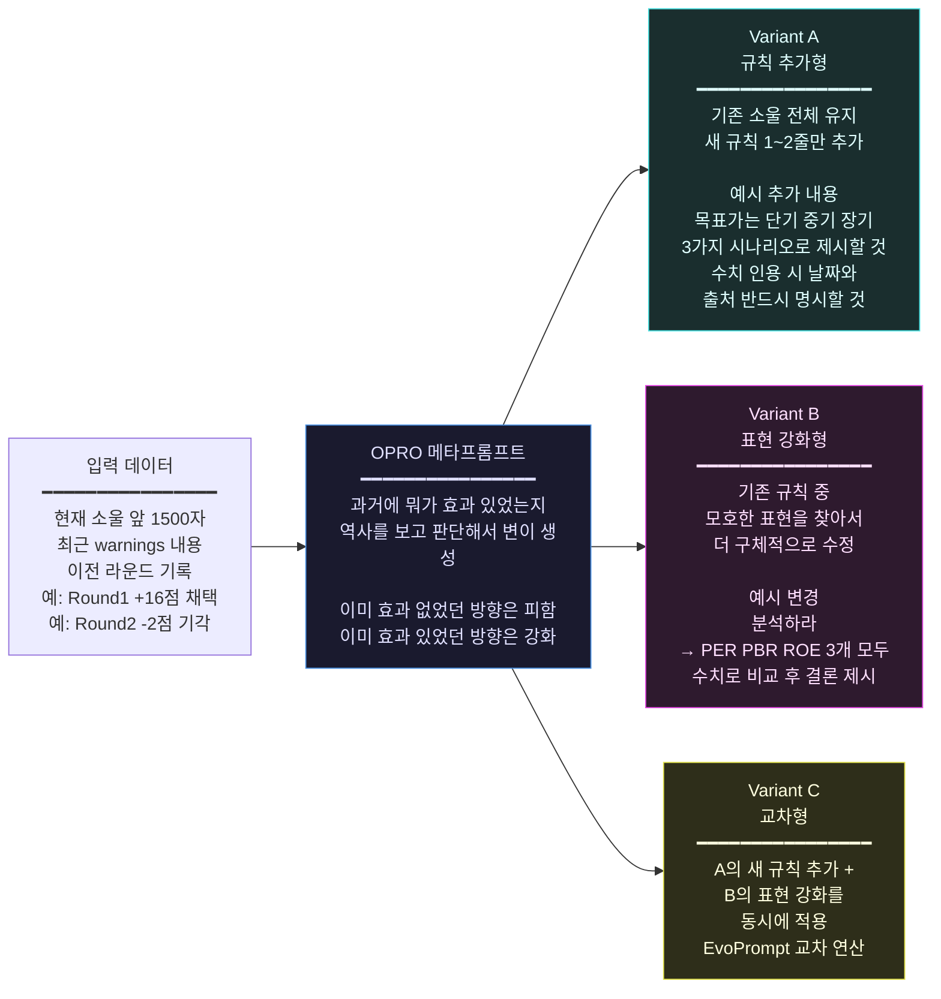
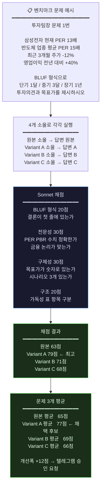
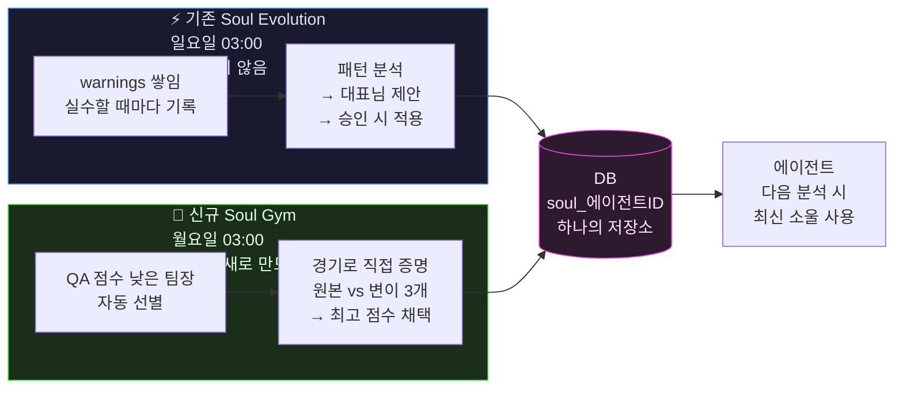

# 🧬 Soul Gym 알고리즘 설계

> VSCode에서 이 파일 열고 **`Ctrl+Shift+V`** 누르면 다이어그램이 크게 보입니다.

---

## 1. 전체 흐름 (대표님용)

---

## 2. 변이 3개 어떻게 만드나 (Haiku 프롬프트 구조)

---

## 3. 채점 방식 (LLM-as-Judge)

---

## 4. 기존 시스템과 관계 (충돌 없음)

---

## 5. Phase별 구현 계획

| Phase | 파일 | 작업 | 규모 |
|-------|------|------|------|
| **1** | `web/db.py` | `soul_gym_rounds` 테이블 추가 + 함수 2개 | +50줄 |
| **2** | `config/soul_gym_benchmarks.yaml` | 6부서 × 3문항 벤치마크 (신규) | 새 파일 |
| **3** | `web/soul_gym_engine.py` | 핵심 진화 엔진 5개 함수 (신규) | ~300줄 |
| **4** | `web/handlers/soul_gym_handler.py` | API 엔드포인트 5개 (신규) | ~100줄 |
| **5** | `web/arm_server.py` | 크론 3줄 + include_router 2줄 | +5줄 |
| **6** | `web/templates/index.html` | 전력분석 탭 Soul Gym 섹션 | +80줄 |
| **7** | 서버 테스트 | Dry Run → 결과 확인 → 실제 실행 | 검증 |

---

## 6. 비용 시뮬레이션

| 항목 | 모델 | 1명당 비용 |
|------|------|-----------|
| 변이 A/B/C 생성 | Haiku | ~$0.15 |
| 벤치마크 실행 (4소울 × 3문항) | 원본 모델 | ~$3.60 |
| QA 채점 (12회) | Sonnet | ~$2.40 |
| **팀장 1명 합계** | | **~$6** |
| 비용 캡 $10 적용 시 | | **2명만 진화** |
| 비용 캡 $20 적용 시 | | **3~4명 진화** |
