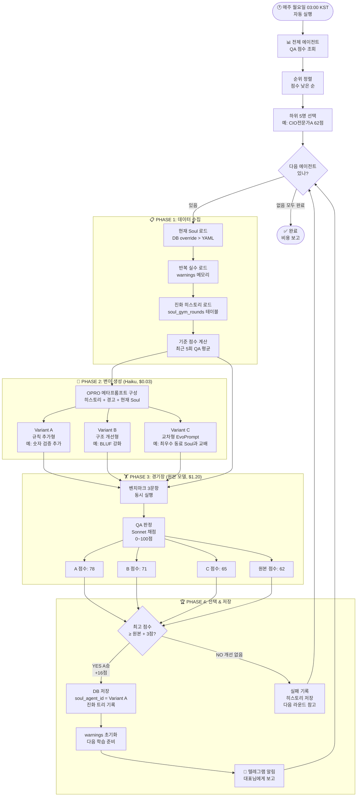
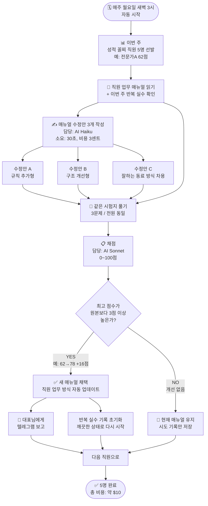
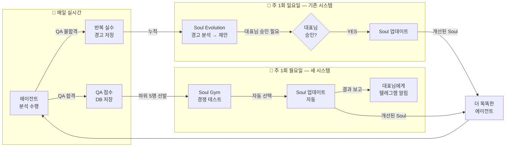
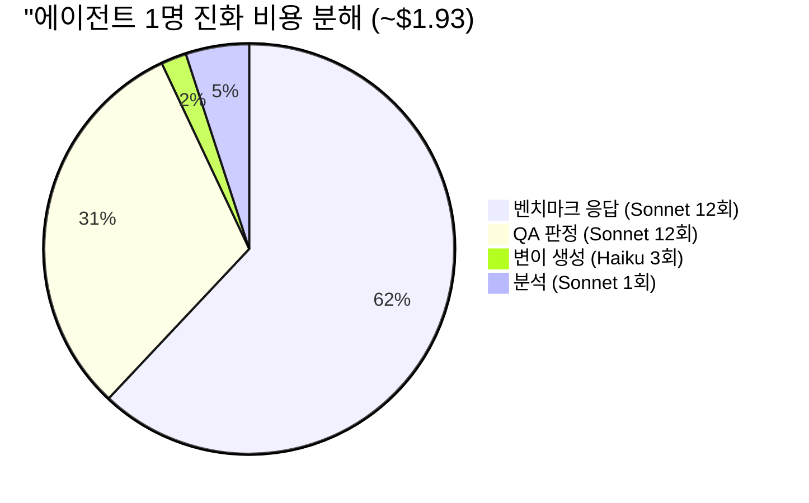
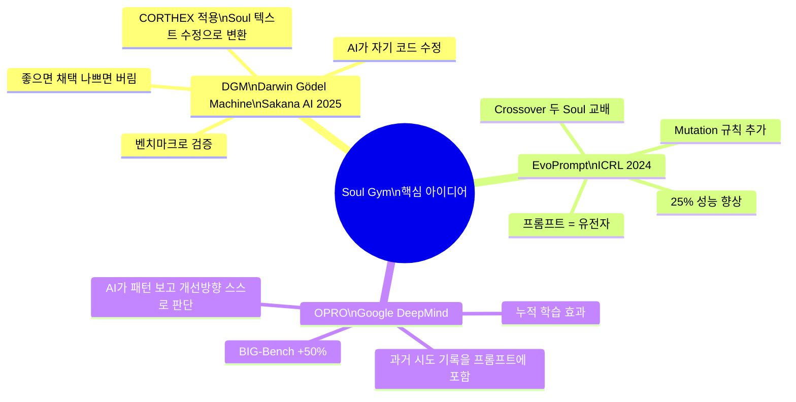

# Soul Gym 플로우차트

> **VSCode에서 `Ctrl+Shift+V` 누르시면 그림으로 보입니다.**
> 또는 https://mermaid.live 에 붙여넣기 하세요.

---

## 1. 개발자용 — 상세 알고리즘 플로우

---

## 2. 대표님용 — 비유 플로우차트

---

## 3. 전체 시스템 흐름 (기존 + 신규 통합)

---

## 4. 비용 시각화

---

## 5. 알고리즘 핵심 논문 비유

