# CORTHEX 도구 전수검사 — 서버 vs AI 최적 실행 전략

> 작성일: 2026-02-26 | 분석 범위: config/tools.yaml 전체 131개 도구
> 목적: AI가 "심부름"까지 하는 낭비 구조를 제거하고 최적 실행 경로 설계

---

## 요약

| 분류 | 개수 | 비율 | 전략 |
|------|------|------|------|
| **서버 우위** | 47개 | 35.9% | 서버가 직접 실행. AI 불필요 |
| **서버+AI** | 51개 | 38.9% | 서버가 데이터 수집 → AI가 해석 |
| **AI 우위** | 33개 | 25.2% | AI만 가능. 신중하게 호출 |

**핵심 문제**: `technical_analyzer`가 1회 분석마다 7번 연속 호출 = 수치 계산을 AI가 도구로 호출하는 낭비

---

## 현재 흐름 vs 최적 흐름 (전체 공통)

```mermaid
flowchart TD
    subgraph 현재["❌ 현재 흐름 (낭비)"]
        A1[팀장 분석 시작] --> B1[AI: kr_stock 도구 호출]
        B1 --> C1[AI: dart_api 도구 호출]
        C1 --> D1[AI: naver_news 도구 호출]
        D1 --> E1[AI: technical_analyzer 호출]
        E1 --> F1[AI: 다시 technical_analyzer 호출]
        F1 --> G1[...7번 반복...]
        G1 --> H1[AI: 드디어 판단]
        H1 --> I1[결과]
    end

    subgraph 목표["✅ 최적 흐름 (목표)"]
        A2[팀장 분석 시작] --> B2[서버: 데이터 병렬 수집\n주가+재무+뉴스+기술지표]
        B2 --> C2[서버: 정량 계산\nRSI+MACD+DCF+VaR]
        C2 --> D2[AI: 패키지 받아서 판단만\n뉴스해석+매매결정+전략수립]
        D2 --> E2[결과]
    end

    style 현재 fill:#fff0f0
    style 목표 fill:#f0fff0
```

---

## 1. 서버 우위 도구 (47개) — AI 호출 없애야 함

### 1-1. 한국/미국 주식 데이터 그룹

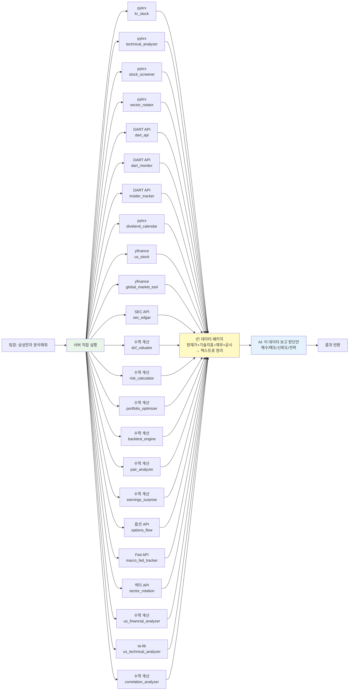

**절감 효과**: 23개 도구 호출이 서버 1회 배치로 → AI 토큰 0 (데이터 수집 단계)

---

### 1-2. 공공/경제 데이터 그룹

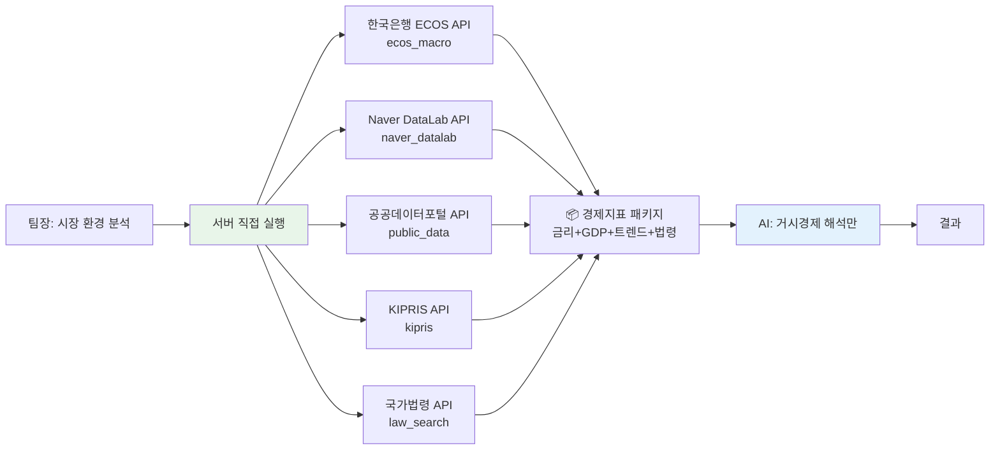

---

### 1-3. 개발/인프라 도구 그룹 (AI 완전 불필요)

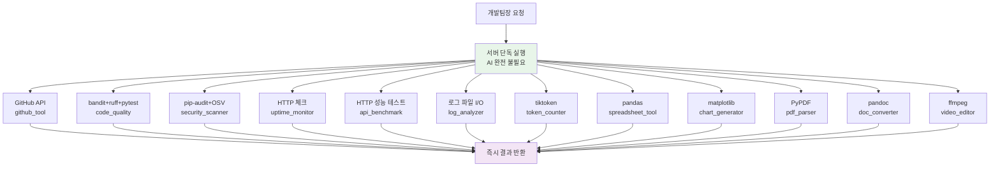

---

### 1-4. 운영/자동화 도구 그룹 (AI 완전 불필요)

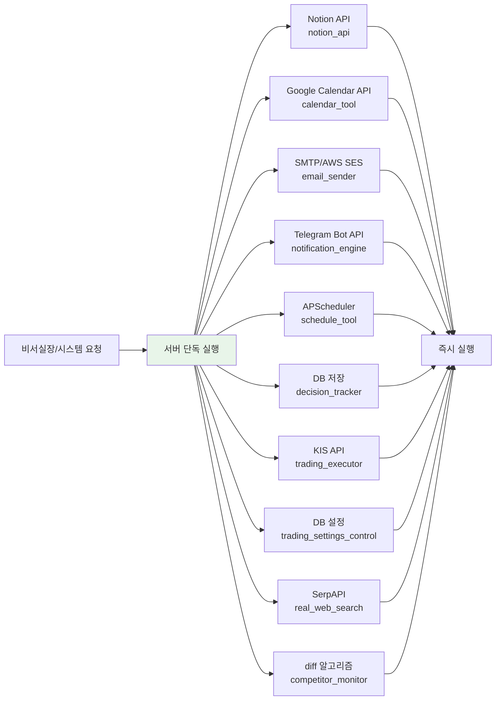

---

### 1-5. 마케팅 분석 (수치 계산만) 그룹

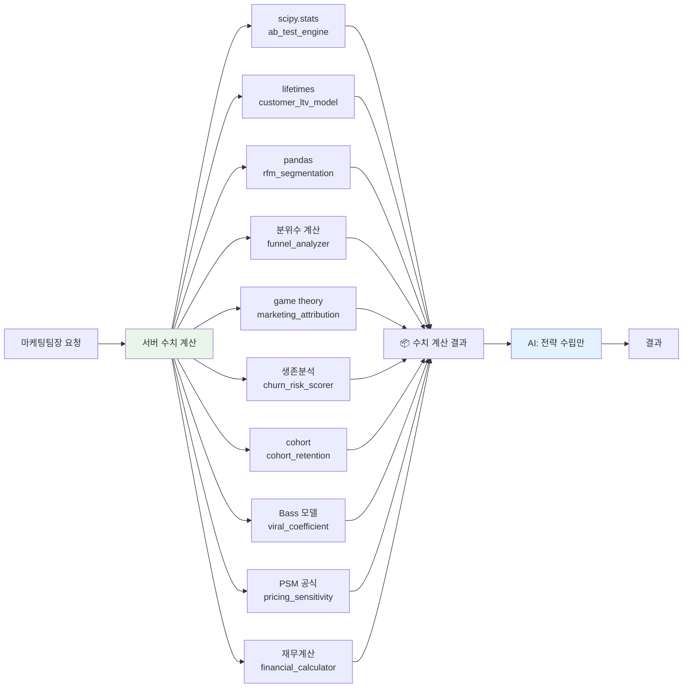

---

## 2. 서버+AI 도구 (51개) — 역할 분리 필요

### 2-1. 뉴스/감성 분석 그룹

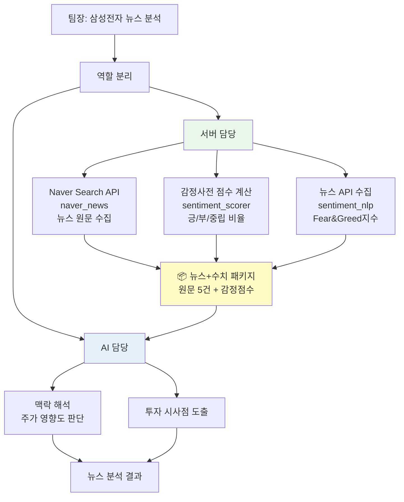

---

### 2-2. 법무 데이터 + 해석 그룹

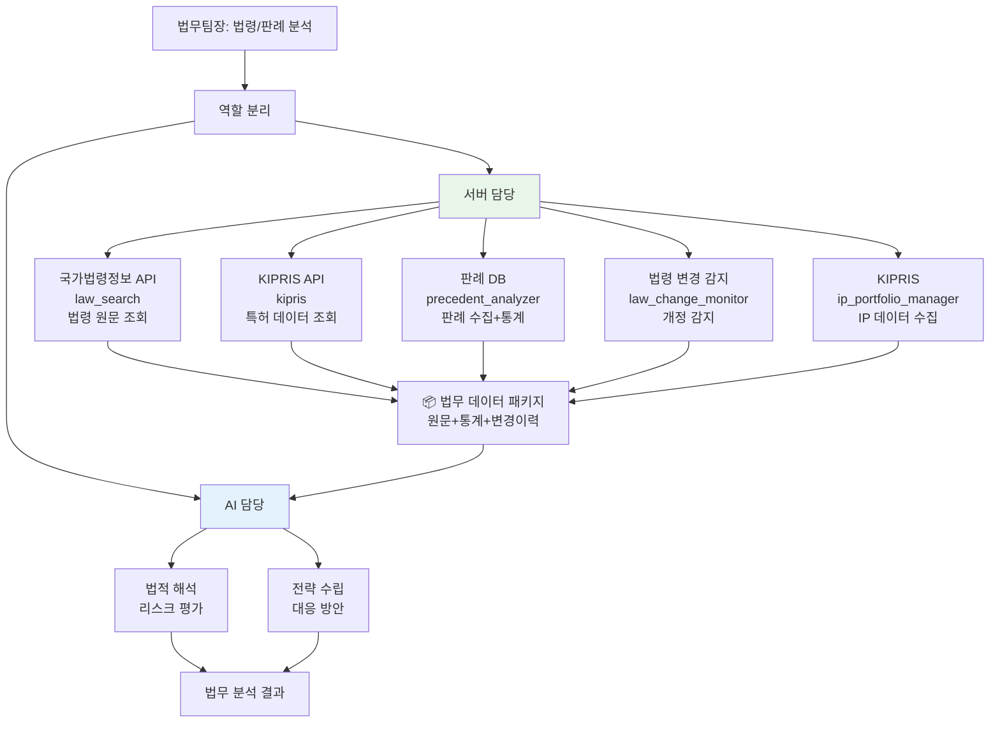

---

### 2-3. 크롤링 + 분석 그룹 (커뮤니티/리뷰)

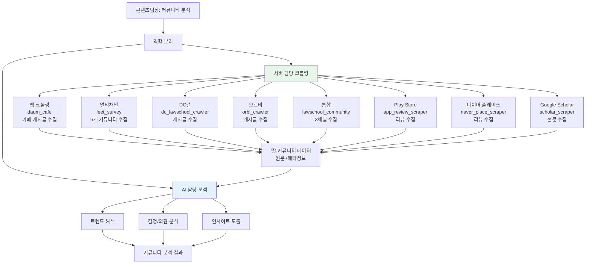

---

### 2-4. 마케팅 채널/경쟁사 + AI 그룹

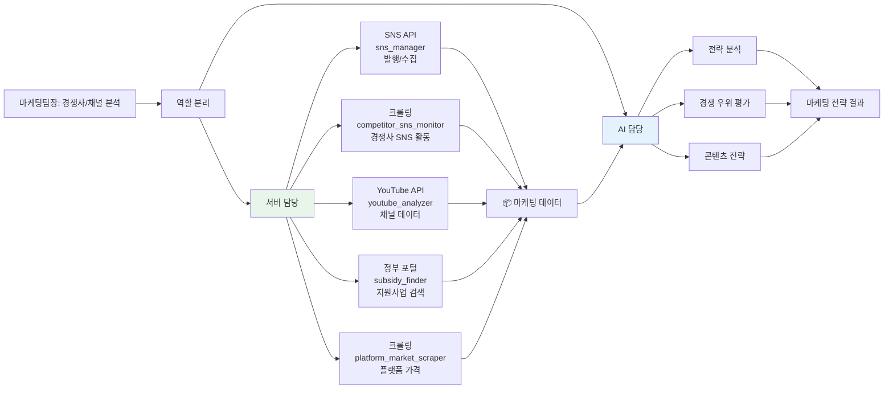

---

### 2-5. 사업기획 분석 그룹

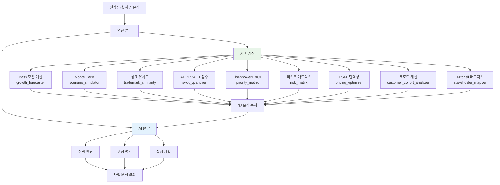

---

### 2-6. 콘텐츠 품질 + AI 그룹

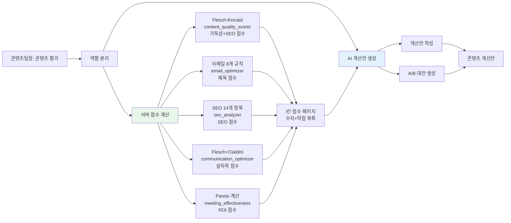

---

### 2-7. 뉴스레터/보고서 생성 그룹

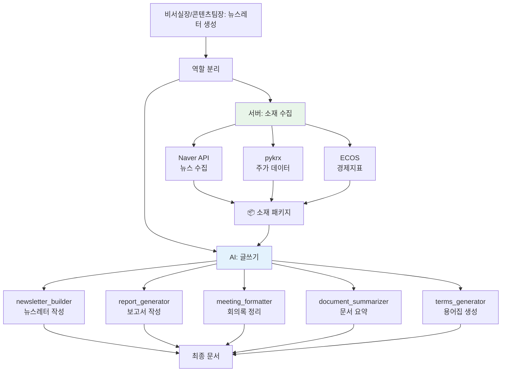

---

## 3. AI 우위 도구 (33개) — AI만 가능, 신중하게 호출

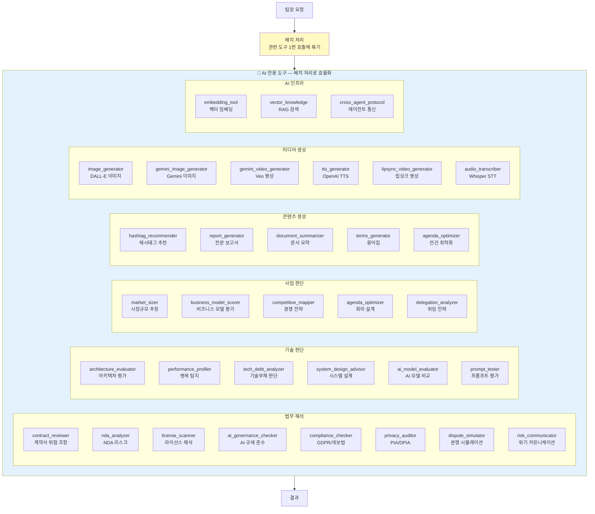

---

## 4. 현재 CIO 분석 흐름 개선안 (가장 낭비 심한 케이스)

### 현재 (❌)

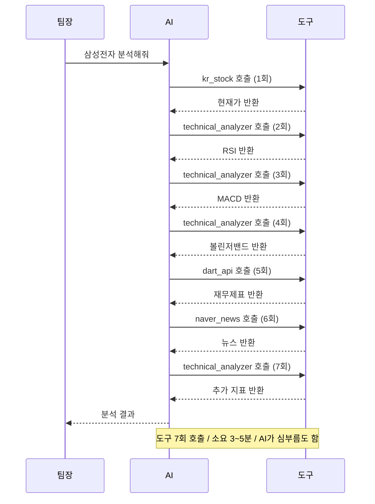

### 최적화 후 (✅)

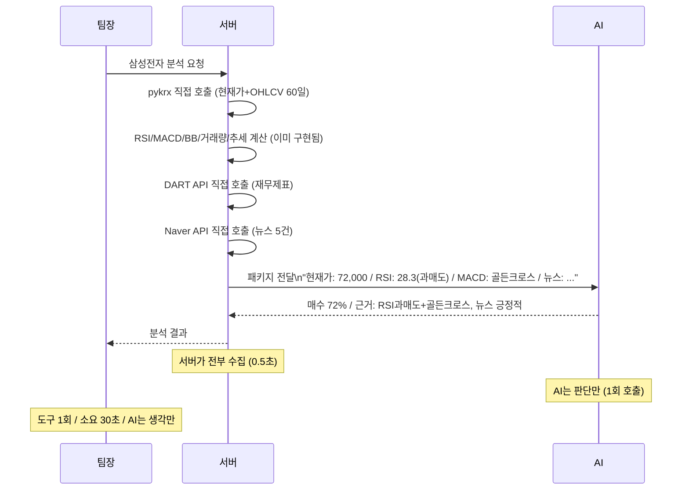

---

## 5. 도구별 최적화 우선순위 및 절감 효과

| 우선순위 | 도구 | 현재 낭비 | 개선 방법 | 예상 절감 |
|---------|------|---------|---------|---------|
| ⭐⭐⭐ | `technical_analyzer` | 1분석당 7회 호출 | 서버 직접 계산 (이미 구현) | 토큰 70% ↓ |
| ⭐⭐⭐ | `kr_stock` | 매번 AI 경유 | pykrx 직접 (이미 가능) | 토큰 100% ↓ |
| ⭐⭐⭐ | `dart_api` | AI가 API 호출 | DART API 서버 직접 | 토큰 100% ↓ |
| ⭐⭐⭐ | `naver_news` | AI가 검색 | Naver API 서버 직접 | 토큰 100% ↓ |
| ⭐⭐ | `ecos_macro` | AI가 API 호출 | ECOS API 서버 직접 | 토큰 100% ↓ |
| ⭐⭐ | `sentiment_scorer` | AI가 점수 계산 | 감정사전 서버 계산 | 토큰 60% ↓ |
| ⭐⭐ | `dcf_valuator` | AI가 수식 계산 | numpy 서버 직접 | 토큰 100% ↓ |
| ⭐⭐ | `portfolio_optimizer` | AI가 MVO 계산 | scipy 서버 직접 | 토큰 100% ↓ |
| ⭐ | `real_web_search` | AI 경유 | SerpAPI 직접 | 토큰 100% ↓ |
| ⭐ | `notification_engine` | AI 경유 | Telegram API 직접 | 토큰 100% ↓ |

---

## 6. 구현 단계별 로드맵

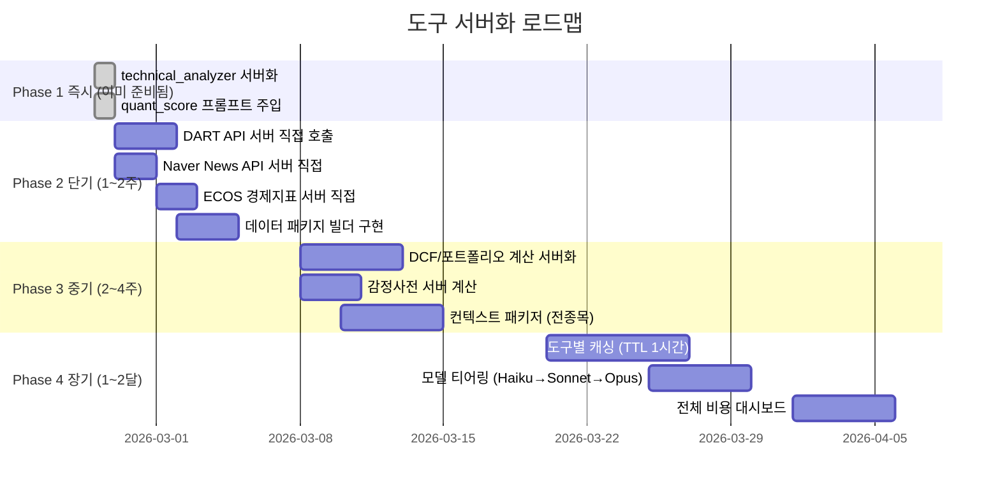

---

## 7. 비용 시뮬레이션

| 시나리오 | AI 호출/분석 | 예상 토큰 | 월간 비용 (분석 100회) |
|---------|------------|---------|---------------------|
| 현재 (낭비) | 15~25회 | ~20,000 | ~$50~100 |
| Phase 2 완료 후 | 5~8회 | ~8,000 | ~$20~40 |
| Phase 4 완료 후 | 2~3회 | ~3,000 | ~$5~15 |

**예상 총 절감: 월 $35~85 (70~85% 절감)**

---

## 8. 크롤링 판단 기준

| 조건 | 분류 | 이유 |
|------|------|------|
| 정해진 URL + 정형 HTML | 서버 우위 | BeautifulSoup으로 충분 |
| 로그인 필요 / SPA | 서버+AI | 서버가 Selenium → AI가 파싱 |
| 비정형 텍스트 해석 필요 | AI 우위 | 의미 추출은 AI만 가능 |
| API 없고 HTML 불규칙 | 서버+AI | 서버가 HTML → AI가 데이터 추출 |

**결론**: 크롤링은 "데이터 수집"은 서버, "의미 추출"은 AI. 대부분의 CORTHEX 크롤링 도구는 서버+AI 패턴이 적합.

---

> 이 문서 기반으로 구현 시 `docs/architecture/` 폴더에 세부 구현 문서 추가 예정
> VSCode에서 `Ctrl+Shift+V` 누르시면 mermaid 플로우차트가 그림으로 보입니다
