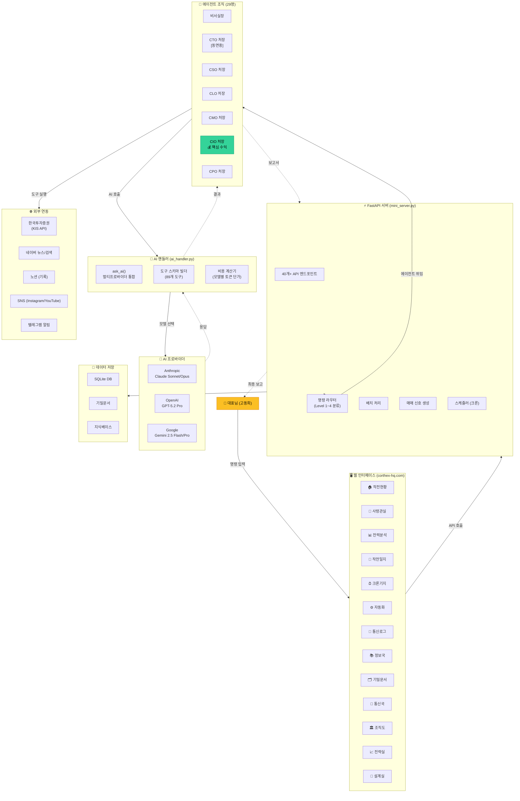

```mermaid
flowchart TB
    CEO["👤 대표님 (고동희)"]

    subgraph UI["🖥️ 웹 인터페이스 (corthex-hq.com)"]
        direction LR
        T1["🏠 작전현황"]
        T2["💬 사령관실"]
        T3["📊 전력분석"]
        T4["📜 작전일지"]
        T5["⏰ 크론기지"]
        T6["⚙️ 자동화"]
        T7["📡 통신로그"]
        T8["📚 정보국"]
        T9["🗂️ 기밀문서"]
        T10["📱 통신국"]
        T11["🏛️ 조직도"]
        T12["📈 전략실"]
        T13["📐 설계실"]
    end

    subgraph SERVER["⚡ FastAPI 서버 (mini_server.py)"]
        direction TB
        API["40개+ API 엔드포인트"]
        ROUTER["명령 라우터\n(Level 1~4 분류)"]
        BATCH["배치 처리"]
        TRADE["매매 신호 생성"]
        SCHED["스케줄러 (크론)"]
    end

    subgraph AI["🧠 AI 핸들러 (ai_handler.py)"]
        direction TB
        ASK["ask_ai()\n멀티프로바이더 통합"]
        TOOLS["도구 스키마 빌더\n(89개 도구)"]
        COST["비용 계산기\n(모델별 토큰 단가)"]
    end

    subgraph PROVIDERS["🤖 AI 프로바이더"]
        CLAUDE["Anthropic\nClaude Sonnet/Opus"]
        GPT["OpenAI\nGPT-5.2 Pro"]
        GEMINI["Google\nGemini 2.5 Flash/Pro"]
    end

    subgraph AGENTS["👥 에이전트 조직 (29명)"]
        direction LR
        CoS["비서실장"]
        CTO["CTO 처장\n[동면중]"]
        CSO["CSO 처장"]
        CLO["CLO 처장"]
        CMO["CMO 처장"]
        CIO["CIO 처장\n💰 핵심 수익"]
        CPO["CPO 처장"]
    end

    subgraph EXTERNAL["🌐 외부 연동"]
        KIS["한국투자증권\n(KIS API)"]
        NAVER["네이버 뉴스/검색"]
        NOTION["노션 (기록)"]
        SNS["SNS (Instagram/YouTube)"]
        TELEGRAM["텔레그램 알림"]
    end

    subgraph STORAGE["💾 데이터 저장"]
        DB["SQLite DB"]
        ARCHIVE["기밀문서"]
        KNOWLEDGE["지식베이스"]
    end

    CEO -->|"명령 입력"| UI
    UI -->|"API 호출"| SERVER
    SERVER --> ROUTER
    ROUTER -->|"에이전트 위임"| AGENTS
    AGENTS -->|"AI 호출"| AI
    AI -->|"모델 선택"| PROVIDERS
    AGENTS -->|"도구 실행"| EXTERNAL
    SERVER --> STORAGE
    PROVIDERS -.->|"응답"| AI
    AI -.->|"결과"| AGENTS
    AGENTS -.->|"보고서"| SERVER
    SERVER -.->|"최종 보고"| CEO

    style CEO fill:#fbbf24,stroke:#d97706,color:#000
    style CIO fill:#34d399,stroke:#059669,color:#000
```
