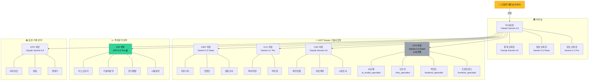

```mermaid
flowchart TD
    CEO["👤 고동희 대표님 (CEO)"]

    subgraph SEC["🏛️ 비서실"]
        CoS["비서실장\nClaude Sonnet 4.6"]
        RI["정보 보좌관\nGemini 3.1 Pro"]
        SS["일정 보좌관\nGemini 2.5 Flash"]
        RS["중계 보좌관\nClaude Sonnet 4.6"]
    end

    subgraph LEET["🔧 LEET Master 기술사업부"]
        CTO["CTO 처장\nGemini 2.5 Flash\n⚠️ 동면중"]
        FE["프론트엔드\nfrontend_specialist"]
        BE["백엔드\nbackend_specialist"]
        INF["인프라\ninfra_specialist"]
        AIE["AI모델\nai_model_specialist"]
        CSO["CSO 처장\nClaude Sonnet 4.6"]
        MRS["시장조사"]
        BPS["사업계획"]
        FMS["재무모델"]
        CLO["CLO 처장\nGemini 3.1 Pro"]
        CPS["저작권"]
        PTS["특허/약관"]
        CMO["CMO 처장\nGemini 2.5 Flash"]
        SUS["설문조사"]
        CNS["콘텐츠"]
        CMS["커뮤니티"]
    end

    subgraph INV["📈 투자분석 본부"]
        CIO["CIO 처장\nGPT-5.2 Pro 💰"]
        MCS["시황분석"]
        SAS["펀더멘탈"]
        TAS["기술적분석"]
        RMS["리스크관리"]
    end

    subgraph PUB["📚 출판·기록 본부"]
        CPO["CPO 처장\nClaude Sonnet 4.6"]
        CHS["연대기"]
        EDS["편집"]
        ARS["아카이브"]
    end

    CEO -->|"명령"| CoS
    CoS --- RI
    CoS --- SS
    CoS --- RS
    CoS --> CTO & CSO & CLO & CMO & CIO & CPO
    CTO --- FE & BE & INF & AIE
    CSO --- MRS & BPS & FMS
    CLO --- CPS & PTS
    CMO --- SUS & CNS & CMS
    CIO --- MCS & SAS & TAS & RMS
    CPO --- CHS & EDS & ARS

    style CEO fill:#fbbf24,stroke:#d97706,color:#000
    style CIO fill:#34d399,stroke:#059669,color:#000
    style CTO fill:#9ca3af,stroke:#6b7280,color:#000
```
