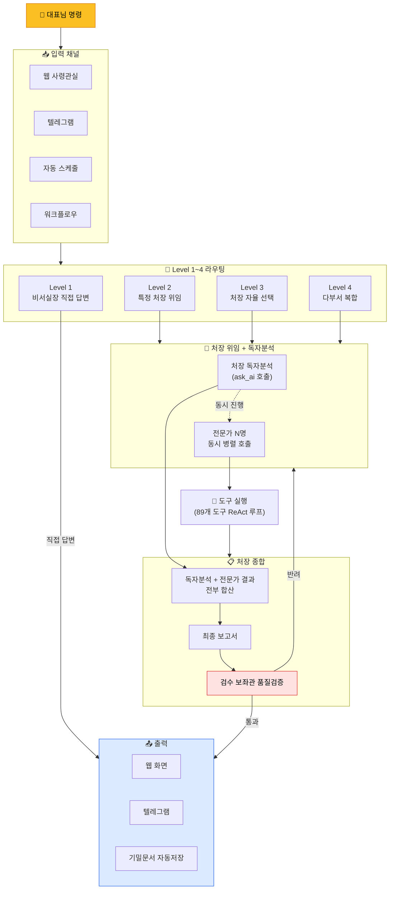

```mermaid
flowchart TD
    INPUT["👤 대표님 명령"]

    subgraph ENTRY["📥 입력 채널"]
        WEB["웹 사령관실"]
        TELEGRAM["텔레그램"]
        SCHEDULE["자동 스케줄"]
        WORKFLOW["워크플로우"]
    end

    subgraph ROUTING["🔀 Level 1~4 라우팅"]
        L1["Level 1\n비서실장 직접 답변"]
        L2["Level 2\n특정 처장 위임"]
        L3["Level 3\n처장 자율 선택"]
        L4["Level 4\n다부서 복합"]
    end

    subgraph DELEGATION["👔 처장 위임 + 독자분석"]
        MGR_SOLO["처장 독자분석\n(ask_ai 호출)"]
        SPAWN["전문가 N명\n동시 병렬 호출"]
        MGR_SOLO -.->|"동시 진행"| SPAWN
    end

    TOOLS["🔧 도구 실행\n(89개 도구 ReAct 루프)"]

    subgraph SYNTHESIS["📋 처장 종합"]
        GATHER["독자분석 + 전문가 결과\n전부 합산"]
        REPORT["최종 보고서"]
        QA["검수 보좌관 품질검증"]
    end

    subgraph OUTPUT["📤 출력"]
        WEB_OUT["웹 화면"]
        TELEGRAM_OUT["텔레그램"]
        ARCHIVE_OUT["기밀문서 자동저장"]
    end

    INPUT --> ENTRY
    ENTRY --> ROUTING
    L1 -->|"직접 답변"| OUTPUT
    L2 & L3 & L4 --> DELEGATION
    SPAWN --> TOOLS
    TOOLS --> SYNTHESIS
    MGR_SOLO --> GATHER
    GATHER --> REPORT --> QA
    QA -->|"통과"| OUTPUT
    QA -->|"반려"| DELEGATION

    style INPUT fill:#fbbf24,stroke:#d97706,color:#000
    style QA fill:#fee2e2,stroke:#dc2626,color:#000
    style OUTPUT fill:#dbeafe,stroke:#2563eb
```
