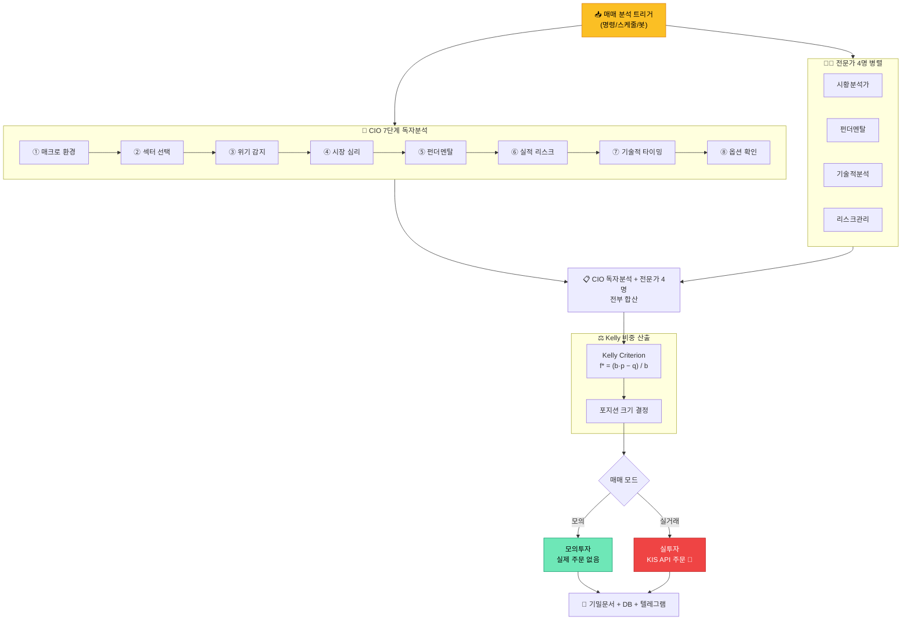

```mermaid
flowchart TD
    TRIGGER["📥 매매 분석 트리거\n(명령/스케줄/봇)"]

    subgraph CIO_7STEP["🧠 CIO 7단계 독자분석"]
        S1["① 매크로 환경"]
        S2["② 섹터 선택"]
        S3["③ 위기 감지"]
        S4["④ 시장 심리"]
        S5["⑤ 펀더멘탈"]
        S6["⑥ 실적 리스크"]
        S7["⑦ 기술적 타이밍"]
        S8["⑧ 옵션 확인"]
        S1 --> S2 --> S3 --> S4 --> S5 --> S6 --> S7 --> S8
    end

    subgraph SPECIALISTS["👨‍💼 전문가 4명 병렬"]
        MCS["시황분석가"]
        SAS["펀더멘탈"]
        TAS["기술적분석"]
        RMS["리스크관리"]
    end

    MERGE["📋 CIO 독자분석 + 전문가 4명\n전부 합산"]

    subgraph KELLY["⚖️ Kelly 비중 산출"]
        CALC["Kelly Criterion\nf* = (b·p − q) / b"]
        SIZE["포지션 크기 결정"]
    end

    MODE{"매매 모드"}
    MOCK["모의투자\n실제 주문 없음"]
    REAL["실투자\nKIS API 주문 🔴"]

    RECORD["📁 기밀문서 + DB + 텔레그램"]

    TRIGGER --> CIO_7STEP & SPECIALISTS
    CIO_7STEP & SPECIALISTS --> MERGE
    MERGE --> CALC --> SIZE --> MODE
    MODE -->|"모의"| MOCK
    MODE -->|"실거래"| REAL
    MOCK & REAL --> RECORD

    style TRIGGER fill:#fbbf24,stroke:#d97706,color:#000
    style REAL fill:#ef4444,stroke:#b91c1c,color:#fff
    style MOCK fill:#6ee7b7,stroke:#059669,color:#000
```
