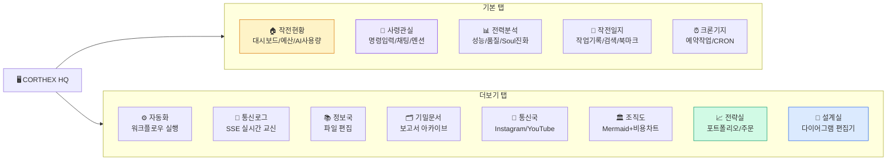

```mermaid
flowchart LR
    APP["🖥️ CORTHEX HQ"]

    subgraph PRIMARY["기본 탭"]
        HOME["🏠 작전현황\n대시보드/예산/AI사용량"]
        CMD["💬 사령관실\n명령입력/채팅/멘션"]
        PERF["📊 전력분석\n성능/품질/Soul진화"]
        HIST["📜 작전일지\n작업기록/검색/북마크"]
        SCHED["⏰ 크론기지\n예약작업/CRON"]
    end

    subgraph SECONDARY["더보기 탭"]
        WORK["⚙️ 자동화\n워크플로우 실행"]
        ACT["📡 통신로그\nSSE 실시간 교신"]
        KNOW["📚 정보국\n파일 편집"]
        ARCH["🗂️ 기밀문서\n보고서 아카이브"]
        SNS["📱 통신국\nInstagram/YouTube"]
        ARCHMAP["🏛️ 조직도\nMermaid+비용차트"]
        TRADE["📈 전략실\n포트폴리오/주문"]
        FLOW["📐 설계실\n다이어그램 편집기"]
    end

    APP --> PRIMARY & SECONDARY

    style HOME fill:#fef3c7,stroke:#d97706
    style CMD fill:#ede9fe,stroke:#7c3aed
    style TRADE fill:#d1fae5,stroke:#059669
    style FLOW fill:#dbeafe,stroke:#2563eb
```
