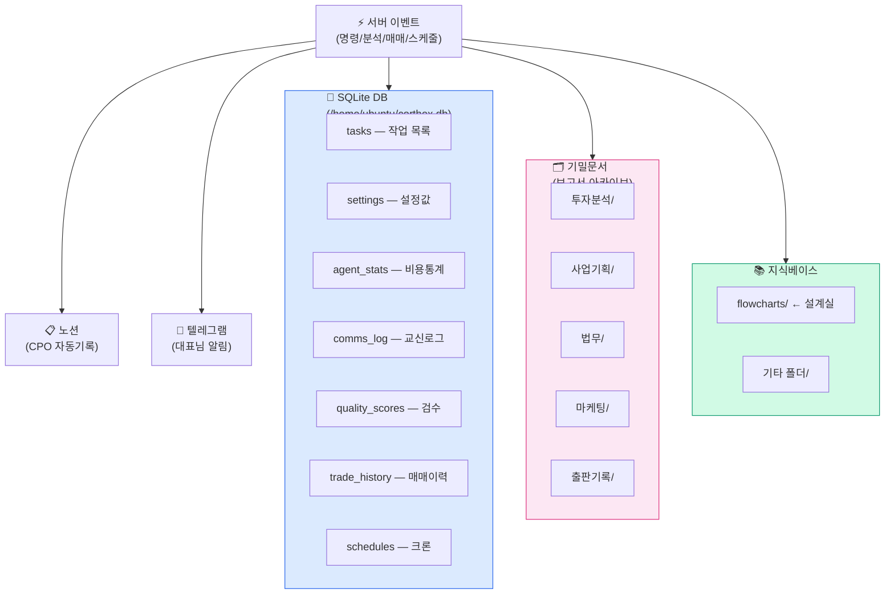

```mermaid
flowchart TD
    ACTION["⚡ 서버 이벤트\n(명령/분석/매매/스케줄)"]

    subgraph SQLITE["💾 SQLite DB\n(/home/ubuntu/corthex.db)"]
        T_TASKS["tasks — 작업 목록"]
        T_SETTINGS["settings — 설정값"]
        T_AGENTS["agent_stats — 비용통계"]
        T_COMMS["comms_log — 교신로그"]
        T_QUALITY["quality_scores — 검수"]
        T_TRADE["trade_history — 매매이력"]
        T_SCHED["schedules — 크론"]
    end

    subgraph ARCHIVE["🗂️ 기밀문서\n(보고서 아카이브)"]
        A_CIO["투자분석/"]
        A_CSO["사업기획/"]
        A_CLO["법무/"]
        A_CMO["마케팅/"]
        A_CPO["출판기록/"]
    end

    subgraph KNOWLEDGE["📚 지식베이스"]
        K_FLOW["flowcharts/ ← 설계실"]
        K_ETC["기타 폴더/"]
    end

    NOTION["📋 노션\n(CPO 자동기록)"]
    TELEGRAM["📱 텔레그램\n(대표님 알림)"]

    ACTION --> SQLITE & ARCHIVE & KNOWLEDGE & NOTION & TELEGRAM

    style SQLITE fill:#dbeafe,stroke:#2563eb
    style ARCHIVE fill:#fce7f3,stroke:#db2777
    style KNOWLEDGE fill:#d1fae5,stroke:#059669
```
